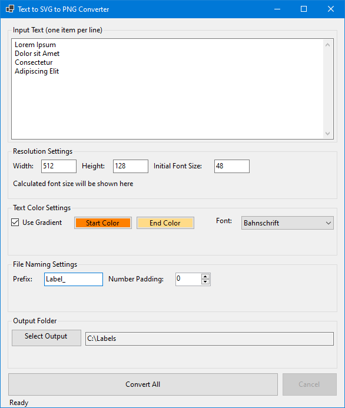

# SVG Text to PNG Batch Converter

A Windows Forms application that generates PNG images from text input. Each line of text is rendered as a separate PNG image with customizable settings including font, colors, and size.

| Application Screenshot |
|:--:|
|  |

| Example Labels |
|:--:|
|   |
|  |
|  |

## Features

- **Batch Processing**: Convert multiple text lines to PNG images in one go
- **Customizable Settings**:
  - Image resolution (width and height)
  - Font selection (uses system fonts)
  - Font size with automatic scaling
  - Text color with gradient option
  - Output file naming with prefix and number padding
- **File Management**:
  - Automatic file overwriting
  - Customizable file naming convention
  - Remembers last used settings
- **Visual Feedback**:
  - Progress bar
  - Current item display
  - Status updates
  - Calculated font size display

## Usage

1. **Input Text**:
   - Enter each text item on a new line in the input box
   - Each line will become a separate PNG image

2. **Configure Settings**:
   - Set desired image width and height
   - Choose font and initial font size
   - Select text color(s)
     - Single color or gradient option
     - Color picker for both start and end colors
   - Configure output file names
     - Set prefix for all files
     - Adjust number padding (0 for no numbers)

3. **Select Output Location**:
   - Choose where to save the PNG files
   - Program remembers last used location

4. **Convert**:
   - Click "Convert All" to start processing
   - Progress bar shows completion status
   - Cancel button available during processing

## File Naming

Files are named using the following format:
- With number padding: `prefix_CleanTextName_001.png`
- Without number padding: `prefix_CleanTextName.png`

Where:
- `prefix` is your chosen prefix
- `CleanTextName` is the input text with special characters removed
- `001` is the sequential number (if padding > 0)

## Requirements

- Windows operating system
- .NET Framework 4.7.2 or higher
- System fonts for text rendering

## Building

1. Open the solution in Visual Studio
2. Restore NuGet packages
3. Build the solution

## Dependencies

- Svg NuGet package for SVG handling
- System.Drawing for image processing
- Windows Forms for the user interface

## License

This project is licensed under the GNU General Public License v3.0 - see the [LICENSE.md](LICENSE.md) file for details.
